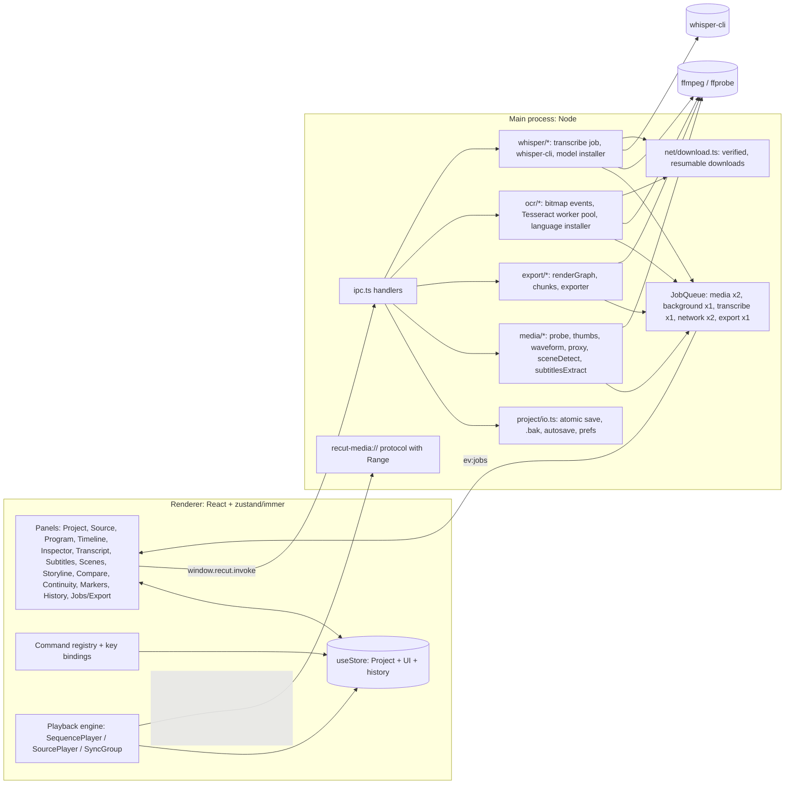

# Architecture

ReCut is an Electron app with three layers:

- **Main process** (`electron/`): Node, window, OS dialogs, files and FFmpeg.
- **Renderer** (`src/`): React UI, editing state and real-time preview.
- **Shared** code (`shared/`): pure TypeScript for the data model, time math and timeline operations, used by both.

The renderer has no Node access. Everything goes through the `window.recut` preload bridge (`contextBridge`,
`electron/preload.ts`) and the IPC contract in `shared/ipc.ts`.



## Main process

| Module | Responsibility |
|---|---|
| `main.ts` | Single-instance lock (a second launch with a `.recut` path opens it in the running window), window creation (bounds persisted in prefs), navigation lock-down, privileged `recut-media` scheme, quit protocol, `RECUT_SMOKE` self-test. |
| `menu.ts` | Native menu. Items send **command ids** over `ev:menu`; the renderer runs them through its command registry (aliases in `src/app/bootstrap.ts`). |
| `ipc.ts` | `ipcMain.handle` for dialogs, project I/O, prefs, fs helpers (stat, listDir, relink scan), media services, jobs and export. Validates arguments at the boundary. |
| `media/protocol.ts` + `range.ts` | `recut-media://local/<encodeURIComponent(path)>` streams local files with full HTTP `Range` / `HEAD` / 206 / 416 support so `<video>` can seek. |
| `media/ffmpeg.ts` | Resolves binaries (env → `<resources>/ffmpeg` → `PATH`), spawns ffmpeg/ffprobe with timeouts, cancellation and progress parsing. `ffmpegFileArg` turns every input / output path into `file:<absolute path>` and refuses a non-absolute one ("media path must be an absolute path"), so no project path is ever read as an FFmpeg protocol. Every media service (probe, thumbnails, filmstrips, waveform, proxy, scene detection, subtitle extraction) and the exporter use it. |
| `media/probe.ts` | ffprobe JSON → `MediaProbe` (streams, rotation, sample aspect ratio, start offsets, VFR flag) and the `browserPlayable` decision. |
| `media/thumbs.ts` | Thumbnails and filmstrips, un-squeezed to the display shape for non-square pixels. They run outside the job queue on a small **LIFO, cancellable** semaphore, so the current viewport wins and abandoned requests never start ffmpeg. |
| `media/waveform.ts` | Streams the audio to u8 mono peaks (O(peaks) memory, even for multi-hour files). Late-starting audio is padded. |
| `media/proxy.ts` | H.264 / AAC proxy transcode carrying every audio stream, one AAC track each in source order: `<cache>/proxies/<key>_<h>p_all.mp4`. If that run fails (a stream FFmpeg cannot decode or encode), it retries with the decodable streams (`<key>_<h>p_a<N>_a<M>….mp4`), then the media's selected stream alone (`_a<N>`), and returns the streams it carries (`ProxyResult.audioStreams`, recorded in `ProxyInfo.audioStreams`). Older single-stream proxies (`<key>_<h>p_a<N>.mp4`, `<key>_<h>p.mp4` = first stream) stay valid for their stream. Still images get `<key>_still.png` (first picture, upright, long side ≤ 3840). Writes a per-job `.part` file first, then renames it. |
| `media/channelProxy.ts` | Channel proxies (Roadmap §9): the preview audio of a clip's channel selection. One audio-only stereo AAC file per (source file, audio stream, selection), `<cache>/proxies/<key>_ch<stream>.<selection>_v1.m4a`, made from the original with the export's own `pan` filter (`shared/audioChannels.ts`), padded to the container start. Job kind `channelProxy` (media lane), de-duplicated per output, `.part` + rename. |
| `media/sceneDetect.ts` | `select='gt(scene,T)'` + `showinfo` on a downscaled stream. Results are cached per threshold. |
| `media/subtitlesExtract.ts` | Embedded text subtitle stream → SRT. Bitmap codecs ReCut can OCR (PGS, VobSub, DVB, XSUB) are refused with a pointer to **Read with OCR…**; teletext and ARIB captions are refused as unsupported. |
| `media/cache.ts` + `identity.ts` | Cache root and keys. `cacheKeyForPath` is a **content key**: size + a SHA-1 of nine sampled 64 KiB blocks (first, last, evenly between; small files whole), with no path or mtime, so derived media survive moves, renames, copies and Collect. It is computed once per path + size + mtime (memory, then `<cache>/ids/<legacy key>`). Entries written by older versions under the legacy `sha1(path + size + mtime)` key are found by `findCachedFile` and adopted under the content key with a hard link. Thumbnails, waveforms, proxies, scene detection and OCR use it; new media caches should too. |
| `jobs/jobQueue.ts` | Five lanes: **media** (proxies, waveforms, extraction; concurrency 2), **background** (scene detection, OCR; 1), **transcribe** (speech-to-text; 1), **network** (OCR language and Whisper model downloads, kind `download`; 2), **export** (exports and Collect Project; 1). Progress, cancel and `AbortSignal` per job. Snapshots are pushed at most 10×/s on `ev:jobs`. `jobs/inFlight.ts` de-duplicates identical requests (same proxy output, same scene-detect key). |
| `ocr/ocrJob.ts` | The `ocr` job (background lane): checks the language file's SHA-256, then the cache (`<cache>/ocr/<key>_s<stream>_<lang>-<sha8>_v<pipeline>-<core>.json`, `.part` + rename), starts the worker pool while FFmpeg isolates the stream, reads each new image's bands on the pool (a band read with confidence under 50 is read again with the polarity flipped), reuses the text of repeated images and merges touching identical lines. Progress: isolate 0–25 %, then "n/N events". Cancel kills FFmpeg and terminates the workers. De-duplicated per path + stream + language. |
| `ocr/bitmapEvents.ts` | Bitmap subtitle stream → timed images: remux the stream alone into a temp file, `ffprobe -show_frames` for the timing, sub2video to raw `ya8` for the pixels (with stdout backpressure); pure `assembleEvents` pairs them, drops blank and < 40 ms events, merges back-to-back repeats and gives each distinct picture an `imageId`. |
| `ocr/preprocess.ts`, `ocr/postprocess.ts` | Pure: crop to the ink, composite onto black and invert (black text on white), split into bands at empty rows, PGM; text clean-up (`|` → `I`, whitespace, punctuation-only lines). |
| `ocr/engine.ts`, `ocr/worker.ts` | A pool of `min(3, cores − 1)` worker threads running Tesseract (tesseract.js 7.0.0 WebAssembly, LSTM-only core: relaxed SIMD when supported, else plain), unpacked from app.asar. The workers never touch the network. `probeOcrCore` feeds the packaged smoke test. |
| `ocr/download.ts`, `ocr/languages.ts`, `ocr/dataDir.ts` | Language installer: `download` jobs (network lane, one per language) fetch pinned `tessdata_fast` files with `net.fetch` through `net/download.ts` under the OCR policy (raw.githubusercontent.com, same-host redirects only) into `<userData>/ocr/tessdata`; remove; install from a local file; `verifyInstalled` before each OCR run. |
| `net/download.ts` | `downloadVerified`: one pinned file into `<dest>.part` (HTTP Range resume, size cap, SHA-256 check, rename into place; cancel and a mismatch delete the `.part`, a network error keeps it). Each caller passes a `DownloadPolicy`: the https origins a download may start from and the exact hosts a redirect may go to (`redirectHosts`); everything else, plain http included, is refused. A loopback origin is accepted only for the test overrides `RECUT_OCR_LANG_URL` / `RECUT_WHISPER_MODEL_URL`. |
| `net/electronFetch.ts` | The HTTP client main.ts gives the downloader: Electron's `net.request` (system proxy, certificates) behind a `fetch` shape. A redirect is returned as a 3xx response with its `location` and never followed (Electron's `net.fetch` rejects `redirect: 'manual'`, bugs/closed/2026-10-07-download-redirect-net-fetch-manual.md); the body is a pull-based stream. |
| `whisper/engine.ts` | The bundled engine: `<resources>/whisper/whisper-cli(.exe)` (or `RECUT_WHISPER_CLI`; never `PATH`), `--version` for About / the smoke test, threads = cores − 1, `killTree` (taskkill /T on Windows). |
| `whisper/models.ts` | Model installer, like the OCR one: `download` jobs fetch pinned ggml models (`shared/whisper.ts`) under the Hugging Face policy (https://huggingface.co, redirects only to `cas-bridge.xethub.hf.co`) into `<userData>/whisper/models`, resumable; remove (also a partial file); install from a local file; the list with partial sizes and disk usage; `verifyModel` (size + SHA-256, hashed once per session while size and mtime stay the same). |
| `whisper/transcribeJob.ts`, `whisper/wav.ts`, `whisper/output.ts` | The `transcribe` job (its own lane): verify the model, cache lookup (`<cache>/whisper/<media key>_s<stream>_<model>-<settings hash>.json`; the media key comes from `transcriptionMediaKey`: the content key `cacheKeyForPath`, so it survives moves), FFmpeg → 16 kHz mono PCM WAV in a temp folder under `<userData>/whisper/tmp`, chunks of ≤ 30 min cut at the quietest 100 ms window in the 20 s before each boundary (streamed: memory does not grow with length), `whisper-cli -oj -pp` per chunk with relative ASCII paths (cwd = the temp folder), progress from `-pp` and the printed segment times, the JSON result repaired (raw control characters, cut UTF-8) and cleaned into cues (non-speech dropped, times clamped). Cancel kills the process; the temp folder is always removed. |
| `export/renderGraph.ts` | Pure: `ExportRequest` → ffmpeg args + `filter_complex` script. Unit-tested. Also used by "Show FFmpeg command". Its segment and transition-handle planning lives in `shared/exportPlan.ts`. |
| `export/chunks.ts` | Pure: decides when to chunk and where the chunk boundaries go. |
| `export/exporter.ts` | Runs the graph (single pass or chunked), parses `-progress`, handles cancel, renders into an exclusively created `<name>.recut-part-<random>.mp4` and moves it onto the output (kept as `<name>.recut-unsaved-<time>.mp4` if that fails), writes the `.srt` sidecar through a temp, cleans temp files. Refuses an output that is a project source file, and an existing output unless the request says `overwrite` (see [export-pipeline.md](export-pipeline.md#output-files)). |
| `safeMkdir.ts` | Creates the output folder level by level, without recursive or blocking mkdir. Refuses `/proc`, `/sys` and `/dev`. Gives up after 5 s. |
| `updateCheck.ts`, `updateIpc.ts` | Update notice: `UpdateChecker` (pure Node, unit-tested) makes one GET to GitHub's `releases/latest` (`net.fetch`, only a `User-Agent: ReCut/<version>` header, no cookies, 10 s timeout, 1 MB cap), remembers the answer in `prefs.json` (`updateCheck`, `updateLastCheckAt`, `updateLatest`, `updateSkipVersion`) and broadcasts `ev:updateStatus`. The automatic check runs 5 s after startup, only when the user opted in, at most once per 24 h; Help › Check for Updates… runs it on demand. Failures are logged, never thrown. `update:openRelease` opens only the repository's releases pages. Rules (semver, reply parser, URL check, throttle) are pure in `shared/update.ts`; the prompt, notice and Help command are `src/app/updates.ts` / `UpdateBanner.tsx`. Nothing is downloaded or installed. |
| `pathSafety.ts` | "Is this the same file as a project source?" for writes: `canonicalPath` (realpath), `fileIdentity` (device + inode) and `findSameFile`, case-folded on every platform. Used by video export and subtitle export. |
| `fs.ts` | fs helpers for IPC (stat, listDir, relink scan) and `writeSubtitleFile` (`subtitles:export`): writes only absolute `.srt` / `.vtt` paths, refuses project source files via `pathSafety.ts`, writes atomically. There is no generic write-file IPC. |
| `project/collect.ts` | Collect Project (`collect:preflight`, `collect:start`): stats the sources of the plan (`shared/collect.ts`), checks the destination (`<dest>/<Project name>` new or empty, free space via `statfs`), then a `collect` job (export lane) streams each file to `.part` with byte progress, verifies size + fingerprint, renames, and writes the rewritten `.recut` last. `COLLECT-INCOMPLETE.txt` marks the folder until the end, and stays (with the reason) after a failure or cancel. |
| `project/io.ts` | Atomic writes (temp + rename) that keep one `.bak` (written via temp + rename, so a symlink there is replaced, not followed), load + `normalizeProjectWithReport` (a repaired file is first copied to `<file>.pre-repair-<ts>`), `.bak` fallback with `fromBackup` for damaged files (the damaged file is kept as `<file>.corrupt-<ts>`), refusal of newer / non-ReCut format versions (never replaced by the `.bak`), autosave / recovery discovery, `prefs.json`, recent projects. |

## Shared code

| Module | Responsibility |
|---|---|
| `model.ts` | Data model types, `EXPORT_PRESETS`. |
| `time.ts` | Rational fps (`isValidFps`: integer terms ≤ 1,000,000, 1–1000 fps), frames ↔ seconds, timecode format / parse including SMPTE drop-frame (`formatSequenceTimecode`, `parseSequenceTimecode`). |
| `timeline.ts` | Pure timeline operations (see Store). |
| `project.ts` | Factories and `normalizeProjectWithReport` / `normalizeProject`: load-time repair and migration. |
| `limits.ts` | Ranges a loaded project must stay within (`MAX_TIMELINE_FRAMES` = 86,400,000, `MAX_SOURCE_SECONDS`, zoom, Preferences ranges, `MAX_PROJECT_DEPTH` = 64). The UI takes its ranges from here too. |
| `media.ts` | Sample aspect ratio rules (`saneSar`: positive safe integers, 1/16–16) and `videoDisplaySize` for the export graph and the preview compositor. |
| `collect.ts` | Collect Project plan: which files (scope, subtitles, proxies), the name-collision scheme (own name; same names from different folders get the fewest distinguishing parent folders as subfolders; numbers last), missing files, and the path rewrite of the collected project. |
| `exportPlan.ts` | Export planning shared by the render graph and the Export dialog's checklist: per-track segments, transition handles (`transitionHandles`: rendered length, or why a transition is shortened or dropped), the range widened so no transition is cut, clips that run past their media. The dialog's pre-export warnings predict exactly what the export renders. |
| `audioChannels.ts` | Per-clip channel selection (Roadmap §9): channel names from FFmpeg layouts (numbered when unknown), the `pan` filter both the render graph and the channel proxy use (one channel as mono, controlled BS.775 downmix), proxy keys, normalisation, and whether Extract Centre Channel can run on a clip. |
| `exportFormat.ts` | Export file formats: containers, encoder arguments (H.264 / H.265, ProRes, DNxHR, AAC / AC-3, PCM, FLAC), extensions, size-estimate rates, the per-track audio file plan, and MKV packaging (output audio tracks as mix definitions, soft subtitle streams, language codes), shared by the render graph and the Export dialog. |
| `linkSync.ts` | Linked-clip sync offsets (`linkedSyncOffsets`), used by the timeline's out-of-sync badge and the Export dialog's warning. |
| `pathKey.ts` | Lexical `path.resolve` + case folding for the renderer's early "is this a project source?" check (subtitle export). The main process repeats the check with realpath and inode (`electron/pathSafety.ts`). |
| `subtitles.ts`, `ipc.ts`, `ids.ts`, `peaks.ts` | SRT / VTT parse + serialize, the IPC contract and `recut-media://` helpers, ids, waveform peaks. |

## Renderer

### Store (`src/state/store.ts`)

One **zustand** store holds `project`, `ui` (selection, source clip, tool, dialogs, filters, ...), `playback`, `jobs`
and `history`. Project changes go through immer:

- `commit(label, recipe)` produces a new immutable `Project`, pushes the **previous project object** onto
  `history.past`, clears redo and marks the project dirty. Undo/redo swap whole project references. Structural
  sharing keeps this cheap: undo is about 0.4 ms on a 2,500-clip project, and history is capped at 200 entries.
  `carryViewState` keeps the current playhead, zoom and In/Out when undoing.
- `quiet(recipe)` changes the project without a history entry. It is used for async mirrors: probe results, proxy
  and scene-detect status, offline flags, the active sequence.
- `beginTransaction` / `updateTransient` / `endTransaction` turn a drag or a multi-step command into one undo step.
- Timeline logic is **pure** in `shared/timeline.ts` (insert/overwrite placement, trims, ripple, roll, slip, slide,
  razor, transitions reconciliation, story-block shifting, `resolveSubtitleCues`). Store actions call it on drafts.
- `sequence.view` is a `LiveView` class instance, which immer does not draft or freeze. `setView` mutates playhead
  and scroll **in place** and bumps `viewTick`, so playback and scrubbing do not create new `Project` objects and do
  not re-render panels that select `sequences`.

`src/state/mediaActions.ts` holds the IPC-backed actions: import with identity parsing, bin routing, sidecar
pickup and auto-proxies; probing; save/open/autosave; relink.

### Shell, panels, commands

- **Layout** (`src/components/layout`): four workspaces (Editing, Research, Audio, Compare) over six zones. Each zone
  has tabs, and panels can be moved between zones, maximized or reset. Layouts persist in `localStorage`.
- **Panel registry** (`src/panels/registry.ts`): every panel calls `registerPanel` from its `index.ts`. **Inactive
  tabs are unmounted** unless `keepAlive` is set. Only Source, Program, Timeline and Compare set it, because they own
  players, canvases or large DOM.
- **Command registry** (`src/keyboard/shortcuts.ts`): commands with id, title, category, `when` and `run`. Default
  chords live in `DEFAULT_BINDINGS` and `EXTRA_META`, and user overrides are saved in prefs. A single window
  key handler (`useShortcuts`) canonicalises chords from `KeyboardEvent.code`. It ignores text fields and dialogs.
  The menu, context menus, buttons and keys all call the same command ids.
- **Transport registry** (`src/app/transport.ts`): Source, Program and Compare each register a `Transport` (toggle,
  setRate, step, seek, mark, ...). Playback and mark commands act on the **active** transport, which follows
  focus. Clicking the Timeline makes the program side active.

### Playback engine (`src/playback`)

```
            PlaybackClock (performance.now, rate -8..8)
                   │
   ┌───────────────┴────────────────┐
SequencePlayer                  SourcePlayer (one <video>, JKL; native at 0<rate≤4, seek-stepped otherwise)
   │ each frame:
   │  planFrame(seq, media, frame)  ← pure planner: per-track indexes, transitions → layers (alpha) + audio (gain)
   │  MediaElementPool.acquire()    ← pooled <video> per (path, role), LRU capacity 12
   │  keep elements at sourceTime + ½ media frame (drift > 80 ms → re-seek)
   │  draw bottom→top on a 2D canvas (transform, crop, opacity, transition alpha), subtitles on top
   │  WebAudio: element → clip gain → track gain → master gain (→ AudioMeter tap); a mono stream played directly
   │            gets 1/√2 in its clip gain, the export's equal-power up-mix (previewUpmixGain)
SyncGroup: two SequencePlayers on one clock with a frame offset (Compare)
```

- `mediaSource.ts` chooses what to play: the proxy if proxies are on and one is ready, else the original if it is
  browser-playable, else a ready proxy, else nothing (reported as missing with a reason). It also applies the
  container start-time offset for originals.
- The canvas renders at the sequence size × **playback resolution** (Full, 1/2, 1/4).
- While paused, the Program redraws when a pooled `<video>` presents a new frame (`requestVideoFrameCallback`), not
  only on `seeked` / `loadeddata`: Chromium can fire those before the landed frame is drawable, and a draw then paints
  the previous frame.
- The Program monitor's "Offline / Needs proxy / Can't play" chips come from the planner's `missing` list.

### Data flow: an insert edit

```
key ','  →  useShortcuts → runCommand('edit.insert')
         →  insertSourceIntoSequence('insert')            (src/panels/source/insert.ts)
         →  maybeConformSequence()  (first clip into an empty sequence: "Change sequence to match clip?")
         →  resolveThreePointEdit() (sequence In/Out, playhead, source In/Out → atFrame, source range)
         →  store.insertFromSource()  → commit('Insert', d => timeline.placeClips(...); carry subtitle cues)
         →  new Project → React panels re-render; SequencePlayer.setSequence() → redraw
```

### Data flow: export

```
Export dialog → window.recut.startExport({ sequence, media, settings, subtitles[, subtitleTracks], protectedPaths[, overwrite] })
  main: validate (absolute folder, not a project source, exists? → code 'exists' → dialog asks "Replace it?")
        → JobQueue('export') → exporter
        per output file (one; or one per audio track for a per-track WAV / FLAC export):
        shouldChunk? ── no ─→ buildRenderGraph → ffmpeg -filter_complex_script → <name>.recut-part-<random>.<ext>
                     └─ yes ─→ per-chunk video (.mp4 / .mov) + audio (.wav f32, one per MKV output track) → concat demuxer join
        (MKV: [aout], [aout1], ... output audio tracks, soft subtitle .srt inputs, stream languages / titles / flags)
        → move onto <name>.<ext> (mp4, mkv, mov, wav, flac), write .srt sidecar (temp + rename), delete temp dir
  progress: ffmpeg -progress → job.progress → ev:jobs → jobsStore → Export dialog / Jobs panel
```

## Timing model

- **Rational frame rates** (`{num, den}`, e.g. 24000/1001) everywhere. Timeline positions and durations are
  **integer frames**. Source positions are **seconds** (sources have their own rates). `clip.speed` is source
  seconds per timeline second.
- **Editor frame choice:** the monitors seek to `sourceTime + 0.5 / mediaFps` and show the frame covering it, i.e.
  media frame `floor(t × mediaFps + 0.5)`.
- **Frame-exact export** (`docs/export-pipeline.md`):
  - Each clip segment is cut in the graph from **absolute source timestamps** (`-copyts -start_at_zero`, `trim` on
    source seconds). `-ss` is only a decode shortcut with a small pre-roll.
  - `settb=AVTB` + `setpts` keep sub-frame phase, so `fps` picks the same frame the editor shows, also for off-grid
    in-points, mixed rates and VFR.
  - `tpad` + `trim=end_frame=N` make every segment exactly N frames. Tracks are re-stamped with
    `settb=den/num,setpts=N`.
  - **Centred transitions:** a D-frame transition covers `[cut − D/2, cut + D/2)` using source handles. Timeline
    positions never move. `xfade` / `acrossfade` consume the extended segments, and the sequence length is unchanged.
  - Audio is rebased to the clip's in-point (a late-starting stream keeps its offset), converted to the output
    layout, mixed with `amix normalize=0`, and padded or trimmed to the exact length.
  - An In/Out range edge inside a transition widens the rendered range, and the composite is trimmed back, so the
    range renders what the full export renders.
  - Anamorphic sources are un-squeezed before the fit scale, and everything is kept at SAR 1.
  - An export frame rate other than the sequence's resamples only the final composite (whole frames repeated or
    dropped); all timeline maths and the audio stay at the sequence rate.
- **Timecode display:** one rule everywhere (`formatSequenceTimecode`): SMPTE drop-frame `HH:MM:SS;FF` at exactly
  30000/1001 and 60000/1001, non-drop otherwise. Typed entry (`parseSequenceTimecode`) reads input the way the
  field displays it.
- **Chunked export:** above 150 inputs or 120 video segments, the range is split at clip edges that never fall inside
  a transition, a fade or a speed-changed audio clip. Video chunks are encoded with closed GOPs and joined with
  `-c copy`. Audio chunks are sample-exact float WAV with one final encode. This bounds FFmpeg memory on very long
  timelines.

## Proxy workflow

1. Import → probe → `browserPlayable === false` and **Use proxies** on → `startProxy` (media lane).
2. `jobsRouter.ts` mirrors queued / running / ready / failed into `media.proxy` (quiet writes) and invalidates pooled
   elements, so the monitors switch to the proxy.
3. The preview uses the proxy. **Export always uses originals** (the render graph never sees a proxy path).
   A clip with a channel selection (`ClipAudio.channelSelection`) plays its **channel proxy** instead, whatever the
   media proxy: `src/app/channelProxies.ts` watches the project, requests the ones clips need (`startChannelProxy`,
   job kind `channelProxy`), mirrors them into `media.channelProxies` and prunes unused entries; until one is ready
   the planner reports the clip as missing ("preview audio … in progress"), like a pending proxy.
4. On open, `verifyMediaOnline` re-checks originals (offline flags) and drops `ready` proxies whose file has gone.

## Relink

- On open, missing originals are flagged **offline**. A banner and the Relink dialog list them.
- **Search folder…** calls `fs:scanForRelink`, which walks the folder and matches by file name + size.
  **Locate…** relinks one file by hand. Applying matches updates `media.path` and re-probes.
- The first probe after a relink fits the clips to the new file: clips that run past its end are trimmed to it and
  clips that start after it are removed, in every sequence (store `fitClipsToRelinkedMedia`, one undo step and a
  warning toast with the counts).

## Autosave, recovery and quit

- **Autosave:** 5 s after the last committed change, at idle (`requestIdleCallback`), and at the configured
  interval (default 60 s). It is deferred while playing. It writes `<project>.recut.autosave`, or
  `<userData>/autosave/untitled.recut.autosave` for an unsaved project, from a renderer-serialised string.
- **Recovery:** at startup, an autosave newer than its project (or the untitled autosave) is offered (**Recover** /
  **Discard**). Corrupt autosaves are ignored. An autosave that needed repairs is still offered, and the prompt says
  it was repaired.
- **Save:** atomic temp + rename, keeping a `.bak`. A structurally damaged main file opens from `.bak` with a toast.
  A file that normalizes with repairs opens with a warning toast that names the `<file>.pre-repair-<ts>` copy. A file
  from a newer format version (or without one) is refused and never replaced by the `.bak`.
- **Open:** `mediaActions.openProject` is the one open path (File › Open, recent, OS open, command line). Loading or
  creating a project closes all modal dialogs of the previous one.
- **Quit:** main sends `ev:beforeQuit`. The renderer **acks** within 3 s (otherwise main force-quits, for a hung
  renderer), asks Save / Don't Save / Cancel if dirty, then confirms with `quit(true)`, or sends `quitCancel` to keep
  running.

## Performance design

- In-place `LiveView` playhead, so no project churn during playback or scrubbing.
- Hidden panels are unmounted. Panels select narrow slices.
- Timeline: viewport culling, plus a **level-of-detail lane** that draws clips narrower than a few pixels as merged
  bars on one canvas per track (`LodLane.tsx`). Filmstrips and waveforms are skipped for very narrow clips. Their requests
  wait for the view to settle and are aborted when the clip leaves the viewport. Thumbnail requests are served
  LIFO.
- Virtualized lists: Project tree, Transcript results, Scene library.
- Planner: per-track sorted indexes and transition maps cached per immutable track object (binary search per frame).
- Caches: thumbnails, filmstrips and waveforms (main-side disk cache plus renderer memory), proxies, scene results,
  all keyed by path + size + mtime.
- Job lanes keep long scene detections from starving proxies. In-flight de-duplication prevents double encodes.
- Projects are saved as compact JSON.

See `docs/attack/performance.md` for the measurements that drove these changes. That report predates most of them.

## Extension points

- **Transcript providers** (`src/transcript/providers.ts`): implement `TranscriptProvider` (`available`,
  `transcribe(mediaPath, opts, onProgress)` → `SubtitleCue[]`) and add it to `PROVIDERS`. It then appears under
  Transcript › Import › **Transcribe…**. `SubtitleFileProvider` (sidecar SRT/VTT) is the working example.
  `LocalWhisperProvider` runs as a main-process job, so it implements `openDialog()` instead: the panel opens the
  Transcribe dialog (`src/panels/whisper/TranscribeDialog.tsx`), which starts one `transcribe` job per media, and
  `jobsRouter.ts` adds each result with `putWhisperSubtitleTrack` (`origin: 'whisper'`; a re-run on the same media,
  audio stream and language replaces the track in one undo step). `src/whisper/whisperUi.ts` holds the dialog state
  and helpers, `src/state/whisperStatus.ts` the model list and engine.
- **Whisper models:** the installable list is `WHISPER_MODELS` in `shared/whisper.ts` (pinned Hugging Face commit, size
  and SHA-256 per model); the engine version is pinned in `scripts/whisper-source.mjs`. Changing the engine changes
  `WHISPER_ENGINE_VERSION`, which is part of the transcription cache key.
- **OCR languages:** the installable list is the manifest in `shared/ocr.ts` (`OCR_LANGUAGES`, generated by
  `scripts/ocr-manifest.mjs` with sizes and SHA-256 for the pinned commit). In the renderer, `src/ocr/ocrUi.ts` holds
  the OCR dialog state and menu helpers, `src/state/ocrStatus.ts` the installed list, and `jobsRouter.ts` turns a
  finished `ocr` job into the media's OCR track (`putOcrSubtitleTrack`, which replaces the earlier track of the same
  stream).
- **Export presets:** add entries to `EXPORT_PRESETS` in `shared/model.ts` (partial `ExportSettings`). The dialog
  lists them, followed by **Match Sequence**.
- **Panels:** `registerPanel({ id, title, component, defaultZone, icon, keepAlive? })` in a new `src/panels/<name>/index.ts`
  imported from `src/panels/index.ts`. It then appears in every zone's "Show panel here" menu.
- **Commands:** `registerCommand({ id, title, category, defaultKeys, when, run })`. Commands show up in the Keyboard
  Shortcuts dialog automatically.
- **Project format:** bump `formatVersion` and migrate in `normalizeProject()` (`shared/project.ts`). See
  [project-format.md](project-format.md). Every saved-project fixture in `tests/fixtures/projects/` (one per stable
  release, made by `scripts/make-project-fixture.mjs`) must keep opening without loss
  (`tests/unit/project-compat.test.ts`); a new kind of project data goes into the fixture scenario too.
