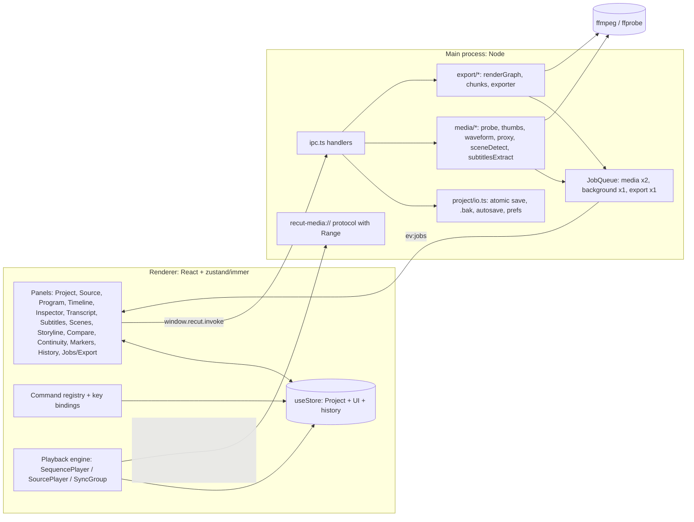

# Architecture

ReCut is an Electron app with three layers:

- **Main process** (`electron/`): Node, window, OS dialogs, files and FFmpeg.
- **Renderer** (`src/`): React UI, editing state and real-time preview.
- **Shared** code (`shared/`): pure TypeScript for the data model, time math and timeline operations, used by both.

The renderer has no Node access. Everything goes through the `window.recut` preload bridge (`contextBridge`,
`electron/preload.ts`) and the IPC contract in `shared/ipc.ts`.



## Main process

| Module | Responsibility |
|---|---|
| `main.ts` | Single-instance lock (a second launch with a `.recut` path opens it in the running window), window creation (bounds persisted in prefs), navigation lock-down, privileged `recut-media` scheme, quit protocol, `RECUT_SMOKE` self-test. |
| `menu.ts` | Native menu. Items send **command ids** over `ev:menu`; the renderer runs them through its command registry (aliases in `src/app/bootstrap.ts`). |
| `ipc.ts` | `ipcMain.handle` for dialogs, project I/O, prefs, fs helpers (stat, listDir, relink scan), media services, jobs and export. Validates arguments at the boundary. |
| `media/protocol.ts` + `range.ts` | `recut-media://local/<encodeURIComponent(path)>` streams local files with full HTTP `Range` / `HEAD` / 206 / 416 support so `<video>` can seek. |
| `media/ffmpeg.ts` | Resolves binaries (env → `<resources>/ffmpeg` → `PATH`), spawns ffmpeg/ffprobe with timeouts, cancellation and progress parsing. |
| `media/probe.ts` | ffprobe JSON → `MediaProbe` (streams, rotation, start offsets, VFR flag) and the `browserPlayable` decision. |
| `media/thumbs.ts` | Thumbnails and filmstrips. They run outside the job queue on a small **LIFO, cancellable** semaphore, so the current viewport wins and abandoned requests never start ffmpeg. |
| `media/waveform.ts` | Streams the audio to u8 mono peaks (O(peaks) memory, even for multi-hour files). Late-starting audio is padded. |
| `media/proxy.ts` | H.264 / AAC proxy transcode to `<cache>/proxies/<key>_<h>p[_a<stream>].mp4`. Writes a per-job `.part` file first, then renames it. |
| `media/sceneDetect.ts` | `select='gt(scene,T)'` + `showinfo` on a downscaled stream. Results are cached per threshold. |
| `media/subtitlesExtract.ts` | Embedded text subtitle stream → SRT. Bitmap codecs are rejected. |
| `media/cache.ts` | Cache root and `sha1(path + size + mtime)` keys. |
| `jobs/jobQueue.ts` | Three lanes: **media** (proxies, waveforms, extraction; concurrency 2), **background** (scene detection; 1), **export** (1). Progress, cancel and `AbortSignal` per job. Snapshots are pushed at most 10×/s on `ev:jobs`. `jobs/inFlight.ts` de-duplicates identical requests (same proxy output, same scene-detect key). |
| `export/renderGraph.ts` | Pure: `ExportRequest` → ffmpeg args + `filter_complex` script. Unit-tested. Also used by "Show FFmpeg command". |
| `export/chunks.ts` | Pure: decides when to chunk and where the chunk boundaries go. |
| `export/exporter.ts` | Runs the graph (single pass or chunked), parses `-progress`, handles cancel, writes `<name>.part.mp4` and renames it, writes the `.srt` sidecar, cleans temp files. Refuses an output path that is one of the inputs. |
| `safeMkdir.ts` | Creates the output folder level by level, without recursive or blocking mkdir. Refuses `/proc`, `/sys` and `/dev`. Gives up after 5 s. |
| `project/io.ts` | Atomic writes (temp + rename) that keep one `.bak`, load + `normalizeProject`, `.bak` fallback with `fromBackup`, refusal of newer format versions, autosave / recovery discovery, `prefs.json`, recent projects. |

## Renderer

### Store (`src/state/store.ts`)

One **zustand** store holds `project`, `ui` (selection, source clip, tool, dialogs, filters, ...), `playback`, `jobs`
and `history`. Project changes go through immer:

- `commit(label, recipe)` produces a new immutable `Project`, pushes the **previous project object** onto
  `history.past`, clears redo and marks the project dirty. Undo/redo swap whole project references. Structural
  sharing keeps this cheap: undo is about 0.4 ms on a 2,500-clip project, and history is capped at 200 entries.
  `carryViewState` keeps the current playhead, zoom and In/Out when undoing.
- `quiet(recipe)` changes the project without a history entry. It is used for async mirrors: probe results, proxy
  and scene-detect status, offline flags, the active sequence.
- `beginTransaction` / `updateTransient` / `endTransaction` turn a drag or a multi-step command into one undo step.
- Timeline logic is **pure** in `shared/timeline.ts` (insert/overwrite placement, trims, ripple, roll, slip, slide,
  razor, transitions reconciliation, story-block shifting, `resolveSubtitleCues`). Store actions call it on drafts.
- `sequence.view` is a `LiveView` class instance, which immer does not draft or freeze. `setView` mutates playhead
  and scroll **in place** and bumps `viewTick`, so playback and scrubbing do not create new `Project` objects and do
  not re-render panels that select `sequences`.

`src/state/mediaActions.ts` holds the IPC-backed actions: import with identity parsing, bin routing, sidecar
pickup and auto-proxies; probing; save/open/autosave; relink.

### Shell, panels, commands

- **Layout** (`src/components/layout`): four workspaces (Editing, Research, Audio, Compare) over six zones. Each zone
  has tabs, and panels can be moved between zones, maximized or reset. Layouts persist in `localStorage`.
- **Panel registry** (`src/panels/registry.ts`): every panel calls `registerPanel` from its `index.ts`. **Inactive
  tabs are unmounted** unless `keepAlive` is set. Only Source, Program, Timeline and Compare set it, because they own
  players, canvases or large DOM.
- **Command registry** (`src/keyboard/shortcuts.ts`): commands with id, title, category, `when` and `run`. Default
  chords live in `DEFAULT_BINDINGS` and `EXTRA_META`, and user overrides are saved in prefs. A single window
  key handler (`useShortcuts`) canonicalises chords from `KeyboardEvent.code`. It ignores text fields and dialogs.
  The menu, context menus, buttons and keys all call the same command ids.
- **Transport registry** (`src/app/transport.ts`): Source, Program and Compare each register a `Transport` (toggle,
  setRate, step, seek, mark, ...). Playback and mark commands act on the **active** transport, which follows
  focus. Clicking the Timeline makes the program side active.

### Playback engine (`src/playback`)

```
            PlaybackClock (performance.now, rate -8..8)
                   │
   ┌───────────────┴────────────────┐
SequencePlayer                  SourcePlayer (one <video>, JKL; native at 0<rate≤4, seek-stepped otherwise)
   │ each frame:
   │  planFrame(seq, media, frame)  ← pure planner: per-track indexes, transitions → layers (alpha) + audio (gain)
   │  MediaElementPool.acquire()    ← pooled <video> per (path, role), LRU capacity 12
   │  keep elements at sourceTime + ½ media frame (drift > 80 ms → re-seek)
   │  draw bottom→top on a 2D canvas (transform, crop, opacity, transition alpha), subtitles on top
   │  WebAudio: element → clip gain → track gain → master gain (→ AudioMeter tap)
SyncGroup: two SequencePlayers on one clock with a frame offset (Compare)
```

- `mediaSource.ts` chooses what to play: the proxy if proxies are on and one is ready, else the original if it is
  browser-playable, else a ready proxy, else nothing (reported as missing with a reason). It also applies the
  container start-time offset for originals.
- The canvas renders at the sequence size × **playback resolution** (Full, 1/2, 1/4).
- The Program monitor's "Offline / Needs proxy / Can't play" chips come from the planner's `missing` list.

### Data flow: an insert edit

```
key ','  →  useShortcuts → runCommand('edit.insert')
         →  insertSourceIntoSequence('insert')            (src/panels/source/insert.ts)
         →  maybeConformSequence()  (first clip into an empty sequence: "Change sequence to match clip?")
         →  resolveThreePointEdit() (sequence In/Out, playhead, source In/Out → atFrame, source range)
         →  store.insertFromSource()  → commit('Insert', d => timeline.placeClips(...); carry subtitle cues)
         →  new Project → React panels re-render; SequencePlayer.setSequence() → redraw
```

### Data flow: export

```
Export dialog → window.recut.startExport({ sequence, media, settings, subtitles })
  main: validate → JobQueue('export') → exporter
        shouldChunk? ── no ─→ buildRenderGraph → ffmpeg -filter_complex_script → <name>.part.mp4
                     └─ yes ─→ per-chunk video (.mp4, closed GOP) + audio (.wav f32) → concat demuxer join
        → rename to <name>.mp4, write .srt sidecar, delete temp dir
  progress: ffmpeg -progress → job.progress → ev:jobs → jobsStore → Export dialog / Jobs panel
```

## Timing model

- **Rational frame rates** (`{num, den}`, e.g. 24000/1001) everywhere. Timeline positions and durations are
  **integer frames**. Source positions are **seconds** (sources have their own rates). `clip.speed` is source
  seconds per timeline second.
- **Editor frame choice:** the monitors seek to `sourceTime + 0.5 / mediaFps` and show the frame covering it, i.e.
  media frame `floor(t × mediaFps + 0.5)`.
- **Frame-exact export** (`docs/export-pipeline.md`):
  - Each clip segment is cut in the graph from **absolute source timestamps** (`-copyts -start_at_zero`, `trim` on
    source seconds). `-ss` is only a decode shortcut with a small pre-roll.
  - `settb=AVTB` + `setpts` keep sub-frame phase, so `fps` picks the same frame the editor shows, also for off-grid
    in-points, mixed rates and VFR.
  - `tpad` + `trim=end_frame=N` make every segment exactly N frames. Tracks are re-stamped with
    `settb=den/num,setpts=N`.
  - **Centred transitions:** a D-frame transition covers `[cut − D/2, cut + D/2)` using source handles. Timeline
    positions never move. `xfade` / `acrossfade` consume the extended segments, and the sequence length is unchanged.
  - Audio is rebased to the clip's in-point (a late-starting stream keeps its offset), converted to the output
    layout, mixed with `amix normalize=0`, and padded or trimmed to the exact length.
- **Chunked export:** above 150 inputs or 120 video segments, the range is split at clip edges that never fall inside
  a transition, a fade or a speed-changed audio clip. Video chunks are encoded with closed GOPs and joined with
  `-c copy`. Audio chunks are sample-exact float WAV with one final encode. This bounds FFmpeg memory on very long
  timelines.

## Proxy workflow

1. Import → probe → `browserPlayable === false` and **Use proxies** on → `startProxy` (media lane).
2. `jobsRouter.ts` mirrors queued / running / ready / failed into `media.proxy` (quiet writes) and invalidates pooled
   elements, so the monitors switch to the proxy.
3. The preview uses the proxy. **Export always uses originals** (the render graph never sees a proxy path).
4. On open, `verifyMediaOnline` re-checks originals (offline flags) and drops `ready` proxies whose file has gone.

## Relink

- On open, missing originals are flagged **offline**. A banner and the Relink dialog list them.
- **Search folder…** calls `fs:scanForRelink`, which walks the folder and matches by file name + size.
  **Locate…** relinks one file by hand. Applying matches updates `media.path` and re-probes.
- Clips longer than the new media are reported, not silently trimmed.

## Autosave, recovery and quit

- **Autosave:** 5 s after the last committed change, at idle (`requestIdleCallback`), and at the configured
  interval (default 60 s). It is deferred while playing. It writes `<project>.recut.autosave`, or
  `<userData>/autosave/untitled.recut.autosave` for an unsaved project, from a renderer-serialised string.
- **Recovery:** at startup, an autosave newer than its project (or the untitled autosave) is offered (**Recover** /
  **Discard**). Corrupt autosaves are ignored.
- **Save:** atomic temp + rename, keeping a `.bak`. A corrupt main file opens from `.bak` with a toast. A file from a
  newer format version is refused.
- **Quit:** main sends `ev:beforeQuit`. The renderer **acks** within 3 s (otherwise main force-quits, for a hung
  renderer), asks Save / Don't Save / Cancel if dirty, then confirms with `quit(true)`, or sends `quitCancel` to keep
  running.

## Performance design

- In-place `LiveView` playhead, so no project churn during playback or scrubbing.
- Hidden panels are unmounted. Panels select narrow slices.
- Timeline: viewport culling, plus a **level-of-detail lane** that draws clips narrower than a few pixels as merged
  bars on one canvas per track (`LodLane.tsx`). Filmstrips and waveforms are skipped for very narrow clips. Their requests
  wait for the view to settle and are aborted when the clip leaves the viewport. Thumbnail requests are served
  LIFO.
- Virtualized lists: Project tree, Transcript results, Scene library.
- Planner: per-track sorted indexes and transition maps cached per immutable track object (binary search per frame).
- Caches: thumbnails, filmstrips and waveforms (main-side disk cache plus renderer memory), proxies, scene results,
  all keyed by path + size + mtime.
- Job lanes keep long scene detections from starving proxies. In-flight de-duplication prevents double encodes.
- Projects are saved as compact JSON.

See `docs/attack/performance.md` for the measurements that drove these changes. That report predates most of them.

## Extension points

- **Transcript providers** (`src/transcript/providers.ts`): implement `TranscriptProvider` (`available`,
  `transcribe(mediaPath, opts, onProgress)` → `SubtitleCue[]`) and add it to `PROVIDERS`. It then appears under
  Transcript › Import › **Transcribe…**. `SubtitleFileProvider` (sidecar SRT/VTT) is the working example.
  `LocalWhisperProvider` is a disabled placeholder. A real local provider should run as a main-process job (the
  `'transcribe'` `JobKind` is reserved) that extracts audio with FFmpeg and streams progress.
- **Export presets:** add entries to `EXPORT_PRESETS` in `shared/model.ts` (partial `ExportSettings`). The dialog
  lists them, followed by **Match Sequence**.
- **Panels:** `registerPanel({ id, title, component, defaultZone, icon, keepAlive? })` in a new `src/panels/<name>/index.ts`
  imported from `src/panels/index.ts`. It then appears in every zone's "Show panel here" menu.
- **Commands:** `registerCommand({ id, title, category, defaultKeys, when, run })`. Commands show up in the Keyboard
  Shortcuts dialog automatically.
- **Project format:** bump `formatVersion` and migrate in `normalizeProject()` (`shared/project.ts`). See
  [project-format.md](project-format.md).
